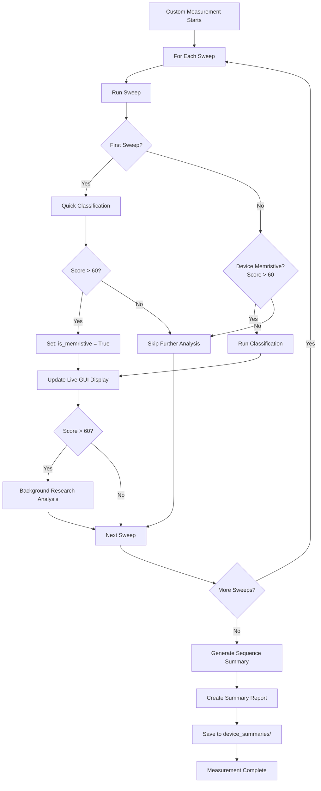

# Custom Measurement Analysis & Summary Reports

## Problem

Currently, analysis runs after EVERY sweep in custom measurements, regardless of device type. For non-memristive devices (ohmic, capacitive), this wastes time. Need:

- Conditional analysis (only if memristive)
- Live classification feedback during sequences
- Summary reports for batch overnight testing

## Solution Architecture



## Implementation Plan

### 1. Conditional Analysis Trigger (gui/measurement_gui/main.py)

**Modify `_run_analysis_if_enabled()`** to add memristive check:

```python
def _run_analysis_if_enabled(
    self,
    voltage: List[float],
    current: List[float],
    timestamps: Optional[List[float]],
    save_dir: str,
    file_name: str,
    metadata: Optional[Dict[str, Any]] = None,
    is_custom_sequence: bool = False,  # NEW
    sweep_number: int = 1,              # NEW
    device_memristive_flag: bool = None # NEW
) -> Optional[Dict[str, Any]]:
    """
    Run analysis with conditional logic for custom sequences.
    
    For custom sequences:
    - Sweep 1: Always analyze to determine if memristive
    - Sweeps 2+: Only analyze if device_memristive_flag == True
    """
    # Skip if not first sweep AND device is not memristive
    if is_custom_sequence and sweep_number > 1:
        if not device_memristive_flag:
            print(f"[ANALYSIS] Skipping sweep {sweep_number} - device not memristive")
            return None
    
    # ... rest of existing analysis logic ...
    
    # After analysis, check if memristive
    if is_custom_sequence and sweep_number == 1:
        score = analysis_data.get('classification', {}).get('memristivity_score', 0)
        is_memristive = score > 60
        print(f"[ANALYSIS] First sweep: score={score:.1f}, memristive={is_memristive}")
        # Store flag for subsequent sweeps
        return {'analysis_data': analysis_data, 'is_memristive': is_memristive}
    
    return analysis_data
```

**Key locations:**

- Line ~706: Method signature
- Line ~740: Add conditional logic
- Line ~866: Return memristive flag for first sweep

---

### 2. Update Custom Measurement Runner (gui/measurement_gui/main.py)

**In `run_custom_measurement()`** around line 4140:

Add tracking variables at start:

```python
# Track device memristive status across sweeps
device_is_memristive = None  # Unknown until first sweep analyzed
sequence_analysis_results = []  # Collect all analysis results
sweep_classifications = {}  # Track score per sweep
```

Update analysis call in sweep loop (around line 4733):

```python
# After data collection for each sweep
analysis_result = self._run_analysis_if_enabled(
    voltage=v_arr,
    current=c_arr,
    timestamps=t_arr,
    save_dir=save_dir,
    file_name=file_name,
    metadata=metadata,
    is_custom_sequence=True,
    sweep_number=key,
    device_memristive_flag=device_is_memristive
)

# Update memristive flag after first sweep
if key == 1 and analysis_result:
    device_is_memristive = analysis_result.get('is_memristive', False)
    
# Collect analysis data
if analysis_result:
    analysis_data = analysis_result.get('analysis_data') or analysis_result
    sequence_analysis_results.append({
        'sweep_number': key,
        'voltage': params.get('stop_v'),
        'analysis': analysis_data
    })
```

At end of device measurement (after all sweeps, around line 4748):

```python
# Generate sequence summary report
if sequence_analysis_results:
    self._generate_sequence_summary(
        device_id=f"{sample_name}_{device_letter}_{device_number}",
        sequence_name=selected_measurement,
        sequence_results=sequence_analysis_results,
        save_dir=save_dir,
        total_sweeps=len(sweeps)
    )
```

---

### 3. Live Classification Display (gui/measurement_gui/main.py)

Add method to update GUI during custom measurements:

```python
def _update_live_classification_display(self, sweep_num: int, total_sweeps: int, 
                                       classification_data: Dict[str, Any]) -> None:
    """
    Update GUI with live classification progress during custom measurements.
    Shows: "Sweep 5/20: Memristive (Score: 75.2) - FORMING"
    """
    try:
        device_type = classification_data.get('device_type', 'unknown')
        score = classification_data.get('memristivity_score', 0)
        
        # Build status message
        status_msg = f"Sweep {sweep_num}/{total_sweeps}: "
        status_msg += f"{device_type.title()} "
        status_msg += f"(Score: {score:.1f}/100)"
        
        # Add forming status if available
        # ... (use existing forming detection logic)
        
        # Update status bar or label
        if hasattr(self, 'status_label'):
            self.status_label.config(text=status_msg)
        
        # Force GUI update
        self.master.update_idletasks()
        
        print(f"[LIVE] {status_msg}")
        
    except Exception as e:
        print(f"[LIVE] Error updating display: {e}")

# FUTURE: Notification placeholder
def _send_classification_notification(self, device_id: str, classification_data: Dict[str, Any]) -> None:
    """
    PLACEHOLDER for future notification system.
    
    TODO: Implement notifications for:
    - Device becomes memristive during forming
    - Score exceeds threshold
    - Degradation detected
    - Sequence complete
    
    Integration options:
    - Telegram bot
    - Email alerts
    - System notifications
    - Webhook POST
    """
    pass
```

Call in `run_custom_measurement()` after analysis:

```python
if analysis_result:
    # Update live display
    self._update_live_classification_display(
        sweep_num=key,
        total_sweeps=len(sweeps),
        classification_data=analysis_result.get('classification', {})
    )
```

---

### 4. Sequence Summary Report Generator (gui/measurement_gui/main.py)

Add new method to generate comprehensive summary:

```python
def _generate_sequence_summary(
    self,
    device_id: str,
    sequence_name: str,
    sequence_results: List[Dict[str, Any]],
    save_dir: str,
    total_sweeps: int
) -> None:
    """
    Generate comprehensive summary report for custom measurement sequence.
    
    Designed for batch overnight testing (100+ devices).
    
    Creates:
    - Text summary (device_summaries/{device_id}_{sequence_name}_summary.txt)
    - JSON data (device_summaries/{device_id}_{sequence_name}_summary.json)
    - Plots (FUTURE - hooks in place)
    """
    try:
        import os
        import json
        from datetime import datetime
        import numpy as np
        
        # Create summaries directory at sample level
        sample_save_dir = self._get_sample_save_directory(self.sample_name_var.get())
        summary_dir = os.path.join(sample_save_dir, "device_summaries")
        os.makedirs(summary_dir, exist_ok=True)
        
        # Extract key metrics from all analyzed sweeps
        scores = []
        voltages = []
        best_sweep = None
        worst_sweep = None
        
        for result in sequence_results:
            classification = result['analysis'].get('classification', {})
            score = classification.get('memristivity_score', 0)
            scores.append(score)
            voltages.append(result['voltage'])
            
            # Track best/worst
            if best_sweep is None or score > best_sweep['score']:
                best_sweep = {'sweep': result['sweep_number'], 'score': score, 'voltage': result['voltage']}
            if worst_sweep is None or score < worst_sweep['score']:
                worst_sweep = {'sweep': result['sweep_number'], 'score': score, 'voltage': result['voltage']}
        
        # Calculate overall device score (weighted average favoring later sweeps)
        # Later sweeps more important for formed devices
        weights = np.linspace(0.5, 1.0, len(scores))  # 0.5 to 1.0
        overall_score = np.average(scores, weights=weights) if scores else 0
        
        # Determine final device status
        final_classification = sequence_results[-1]['analysis'].get('classification', {})
        final_device_type = final_classification.get('device_type', 'unknown')
        
        # Detect forming process
        score_improvement = scores[-1] - scores[0] if len(scores) > 1 else 0
        is_forming = score_improvement > 15  # >15 point improvement
        
        # === TEXT SUMMARY ===
        lines = []
        lines.append("=" * 80)
        lines.append(f"CUSTOM MEASUREMENT SEQUENCE SUMMARY")
        lines.append("=" * 80)
        lines.append(f"Device: {device_id}")
        lines.append(f"Sequence: {sequence_name}")
        lines.append(f"Date: {datetime.now().strftime('%Y-%m-%d %H:%M:%S')}")
        lines.append(f"Total Sweeps: {total_sweeps}")
        lines.append(f"Analyzed Sweeps: {len(scores)} (memristive sweeps only)")
        lines.append("")
        
        lines.append("OVERALL ASSESSMENT")
        lines.append("-" * 80)
        lines.append(f"Overall Device Score: {overall_score:.1f}/100")
        lines.append(f"Final Classification: {final_device_type.upper()}")
        
        # Rating
        if overall_score >= 80:
            rating = "EXCELLENT - Ready for advanced testing"
        elif overall_score >= 60:
            rating = "GOOD - Suitable for basic memristive applications"
        elif overall_score >= 40:
            rating = "FAIR - May need additional forming"
        else:
            rating = "POOR - Not suitable for memristive applications"
        lines.append(f"Rating: {rating}")
        
        if is_forming:
            lines.append(f"Forming Detected: YES (improved {score_improvement:.1f} points)")
        lines.append("")
        
        lines.append("KEY SWEEPS")
        lines.append("-" * 80)
        if best_sweep:
            lines.append(f"Best Sweep: #{best_sweep['sweep']} @ {best_sweep['voltage']:.1f}V (Score: {best_sweep['score']:.1f})")
        if worst_sweep and worst_sweep['sweep'] != best_sweep['sweep']:
            lines.append(f"Worst Sweep: #{worst_sweep['sweep']} @ {worst_sweep['voltage']:.1f}V (Score: {worst_sweep['score']:.1f})")
        lines.append("")
        
        lines.append("SWEEP-BY-SWEEP PROGRESSION")
        lines.append("-" * 80)
        for result in sequence_results:
            classification = result['analysis'].get('classification', {})
            score = classification.get('memristivity_score', 0)
            device_type = classification.get('device_type', 'unknown')
            lines.append(f"Sweep #{result['sweep_number']:2d} @ {result['voltage']:4.1f}V: "
                        f"{device_type:12s} Score: {score:5.1f}/100")
        lines.append("")
        
        lines.append("DETAILED METRICS (Final Sweep)")
        lines.append("-" * 80)
        final_analysis = sequence_results[-1]['analysis']
        
        # Resistance
        resistance = final_analysis.get('resistance_metrics', {})
        lines.append(f"Ron (mean):  {resistance.get('ron_mean', 0):.2e} Ω")
        lines.append(f"Roff (mean): {resistance.get('roff_mean', 0):.2e} Ω")
        lines.append(f"Switching Ratio: {resistance.get('switching_ratio_mean', 0):.1f}")
        lines.append("")
        
        # Hysteresis
        hysteresis = final_analysis.get('hysteresis_metrics', {})
        lines.append(f"Hysteresis: {('Yes' if hysteresis.get('has_hysteresis') else 'No')}")
        lines.append(f"Pinched: {('Yes' if hysteresis.get('pinched_hysteresis') else 'No')}")
        lines.append("")
        
        # Quality metrics
        if 'memory_window_quality' in final_classification:
            quality = final_classification['memory_window_quality']
            lines.append(f"Memory Window Quality: {quality.get('overall_quality_score', 0):.1f}/100")
        lines.append("")
        
        lines.append("=" * 80)
        lines.append("NOTES FOR BATCH PROCESSING:")
        lines.append(f"- Data Location: {save_dir}")
        lines.append(f"- Device Tracking: {sample_save_dir}/device_tracking/{device_id}_history.json")
        if overall_score > 60:
            lines.append(f"- Research Data: {sample_save_dir}/device_research/{device_id}/")
        lines.append("")
        lines.append("FUTURE ENHANCEMENTS:")
        lines.append("- [ ] Trend plots (score vs voltage, Ron/Roff evolution)")
        lines.append("- [ ] Comparative analysis across devices")
        lines.append("- [ ] Statistical summary for entire sample (100+ devices)")
        lines.append("- [ ] Automated report generation (PDF/HTML)")
        lines.append("=" * 80)
        
        # Save text summary
        text_file = os.path.join(summary_dir, f"{device_id}_{sequence_name}_summary.txt")
        with open(text_file, 'w') as f:
            f.write('\n'.join(lines))
        
        # === JSON SUMMARY (for programmatic access) ===
        json_summary = {
            'device_id': device_id,
            'sequence_name': sequence_name,
            'timestamp': datetime.now().isoformat(),
            'total_sweeps': total_sweeps,
            'analyzed_sweeps': len(scores),
            'overall_score': float(overall_score),
            'final_device_type': final_device_type,
            'forming_detected': is_forming,
            'score_improvement': float(score_improvement) if score_improvement else 0,
            'best_sweep': best_sweep,
            'worst_sweep': worst_sweep,
            'sweep_progression': [
                {
                    'sweep_number': r['sweep_number'],
                    'voltage': r['voltage'],
                    'score': r['analysis'].get('classification', {}).get('memristivity_score', 0),
                    'device_type': r['analysis'].get('classification', {}).get('device_type', 'unknown')
                }
                for r in sequence_results
            ],
            'final_metrics': {
                'resistance': final_analysis.get('resistance_metrics', {}),
                'hysteresis': final_analysis.get('hysteresis_metrics', {}),
                'classification': final_classification
            },
            'data_locations': {
                'raw_data': save_dir,
                'tracking': f"{sample_save_dir}/device_tracking/{device_id}_history.json",
                'research': f"{sample_save_dir}/device_research/{device_id}/" if overall_score > 60 else None
            }
        }
        
        # Save JSON summary
        json_file = os.path.join(summary_dir, f"{device_id}_{sequence_name}_summary.json")
        with open(json_file, 'w') as f:
            json.dump(json_summary, f, indent=2)
        
        print(f"[SUMMARY] Sequence summary saved:")
        print(f"[SUMMARY]   Text: {text_file}")
        print(f"[SUMMARY]   JSON: {json_file}")
        print(f"[SUMMARY]   Overall Score: {overall_score:.1f}/100 ({final_device_type.upper()})")
        
        # FUTURE: Generate plots
        # self._generate_sequence_plots(json_summary, summary_dir)
        
    except Exception as e:
        print(f"[SUMMARY ERROR] Failed to generate sequence summary: {e}")
        import traceback
        traceback.print_exc()
```

---

### 5. File Structure

After implementation, overnight batch run creates:

```
Data_folder/
└── SampleName/
    ├── device_tracking/           # Per-measurement tracking
    │   ├── Sample_A_1_history.json
    │   ├── Sample_A_2_history.json
    │   └── ...
    ├── device_research/           # Research analyses
    │   ├── Sample_A_1/
    │   └── Sample_A_2/
    └── device_summaries/          # NEW: Sequence summaries
        ├── Sample_A_1_Sdt_V2_summary.txt
        ├── Sample_A_1_Sdt_V2_summary.json
        ├── Sample_A_2_Sdt_V2_summary.txt
        ├── Sample_A_2_Sdt_V2_summary.json
        └── ... (100+ devices)
```

---

## Summary Report Features

**For Each Device:**

- Overall memristive score (0-100)
- Final classification
- Forming detection (Yes/No)
- Best/worst sweeps highlighted
- Sweep-by-sweep progression table
- Final resistance metrics
- Data location references

**Designed For:**

- Overnight batch testing (100+ devices)
- Quick screening in the morning
- Identifying best devices for further testing
- Tracking forming protocols

**Future Extensions (Placeholders in Code):**

- Trend plots (score vs voltage)
- Comparative plots (all devices overlay)
- Statistical summary (mean, std, histogram)
- PDF/HTML report generation
- Email summary on completion

---

## Testing Steps

1. Run custom measurement on single device (e.g., "Sdt V2")
2. Verify only memristive sweeps are analyzed
3. Check live classification updates in GUI
4. After completion, check `device_summaries/` folder
5. Review text and JSON summary files
6. Verify overall score calculation
7. Run on multiple devices to test batch mode