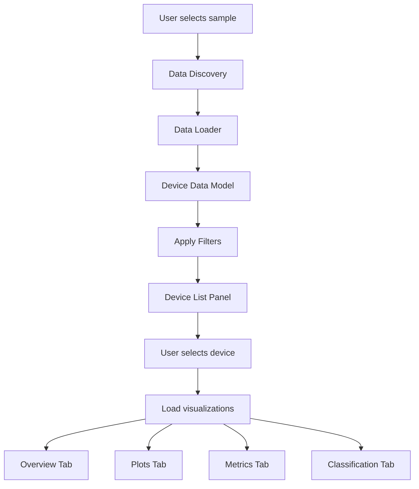

# Device Analysis Visualizer - Qt5 Application

## Overview

A standalone Qt5 application for quickly assessing device performance, memristivity, and classification. Enables browsing devices by sample/section/device, viewing all analysis data, and filtering by score/type.

## Architecture

```
┌─────────────────────────────────────────────────────────────┐
│                     MainWindow (QMainWindow)                 │
├─────────────────────────────────────────────────────────────┤
│  ┌──────────┐  ┌──────────────────────────────────────────┐ │
│  │  Sample  │  │         Tabbed Device View               │ │
│  │Selector  │  │  ┌────────┬────────┬────────┬─────────┐  │ │
│  │          │  │  │Overview│  Plots │ Metrics│Classif. │  │ │
│  └──────────┘  │  └────────┴────────┴────────┴─────────┘  │ │
│  ┌──────────┐  │                                             │ │
│  │  Filter  │  │         Visualization Area                 │ │
│  │ Controls │  │  (I-V plots, heatmaps, charts, etc.)      │ │
│  └──────────┘  └──────────────────────────────────────────┘ │
│  ┌──────────┐  ┌──────────────────────────────────────────┐ │
│  │  Device  │  │         Stats/Info Sidebar                │ │
│  │   List   │  │  (Scores, classification, key metrics)    │ │
│  └──────────┘  └──────────────────────────────────────────┘ │
└─────────────────────────────────────────────────────────────┘
```

## File Structure

```
Helpers/Visualization/
├── __init__.py
├── device_visualizer_app.py          # Main application entry point
├── data/
│   ├── data_discovery.py             # Dynamic data file discovery
│   ├── data_loader.py                # Load JSON, TXT, parse logs
│   └── device_data_model.py          # Data models for devices
├── widgets/
│   ├── main_window.py                # Main QMainWindow
│   ├── sample_selector.py            # Sample/Section/Device selection
│   ├── device_list_panel.py          # Scrollable device list sidebar
│   ├── filter_panel.py               # Filter controls (type, score)
│   ├── overview_tab.py               # Dashboard/summary view
│   ├── plots_tab.py                  # I-V plots, hysteresis
│   ├── metrics_tab.py                # Charts, comparisons
│   ├── classification_tab.py         # Classification breakdown
│   └── yield_heatmap_widget.py       # Device grid heatmap
└── utils/
    ├── plot_utils.py                 # Matplotlib/Qt integration
    └── color_themes.py               # Color schemes for visualizations
```

## Core Components

### 1. Data Discovery (`data/data_discovery.py`)

**Purpose**: Flexibly locate data files even if folder structure changes.

**Strategy**: Hybrid approach

- **Primary**: Try standard locations first:
  - `{sample}/sample_analysis/analysis/device_tracking/{device_id}_history.json`
  - `{sample}/G/{device_num}/sweep_analysis/{filename}_research.json`
  - `{sample}/G/{device_num}/classification_log.txt`
  - `{sample}/G/{device_num}/*.txt` (raw data)

- **Fallback**: Pattern-based scanning:
  - Recursively scan for `*_history.json` files
  - Find `*_research.json` files
  - Locate `classification_log.txt` files
  - Match by device ID patterns

**Key Methods**:

- `discover_sample_structure(base_path)` → Returns sample metadata
- `find_device_tracking_files(sample_path, device_id)` → List of tracking files
- `find_research_files(device_path)` → List of research JSON files
- `find_classification_logs(device_path)` → Classification log file
- `find_raw_data_files(device_path)` → List of .txt measurement files

### 2. Data Loader (`data/data_loader.py`)

**Purpose**: Parse and aggregate all data sources into unified device objects.

**Data Sources**:

- Device tracking JSON (`_history.json`) → Measurement history, evolution
- Research JSON (`_research.json`) → Detailed analysis results
- Classification logs (`classification_log.txt`, `classification_summary.txt`) → Current classifications
- Raw measurement files (`*.txt`) → I-V data for plotting

**Key Classes**:

- `DeviceData` (dataclass): Unified device representation
  - `device_id`, `sample_name`, `section`, `device_number`
  - `current_classification`, `memristivity_score`, `confidence`
  - `measurements[]`, `research_data`, `raw_data_files`
  - `metrics` (Ron, Roff, ON/OFF, etc.)

- `DataLoader`:
  - `load_sample(sample_path)` → Dict[device_id, DeviceData]
  - `load_device_tracking(file_path)` → Parsed tracking data
  - `parse_classification_log(log_path)` → Classification dict
  - `load_raw_measurement(txt_path)` → voltage, current arrays

### 3. Main Window (`widgets/main_window.py`)

**Layout**:

- **Left Panel** (fixed width ~250px):
  - Sample selector (dropdown/tree)
  - Filter panel (device type, score range)
  - Device list (scrollable, shows device IDs + scores)

- **Center Panel** (main area):
  - Tabbed interface (Overview, Plots, Metrics, Classification)
  - Yield heatmap widget (overview tab)

- **Right Sidebar** (optional, collapsible ~200px):
  - Quick stats panel
  - Key metrics display

**Features**:

- Auto-select highest score device on sample load
- Keyboard shortcuts (arrow keys for device navigation)
- Export current view (screenshot, data export)

### 4. Visualization Widgets

#### Overview Tab (`widgets/overview_tab.py`)

- **Yield Heatmap**: Grid of devices colored by memristivity score
  - Click device → load it in main view
  - Hover tooltip shows device ID and score
- **Summary Dashboard**: 
  - Current device classification card
  - Memristivity score gauge/chart
  - Quick metrics (Ron, Roff, ON/OFF ratio)
  - Best/worst sweeps highlight

#### Plots Tab (`widgets/plots_tab.py`)

- **I-V Hysteresis Plot**: Main hysteresis loop(s)
  - Overlay multiple cycles if available
  - Highlight ON/OFF points
  - Show pinched hysteresis indication
- **Resistance vs Voltage**: Log-scale R(V) plot
- **Cycle Overlay**: Multiple cycles comparison
- **Time Series** (if available): Evolution plots

#### Metrics Tab (`widgets/metrics_tab.py`)

- **Comparison Charts**:
  - Ron vs Roff scatter
  - Switching ratio distribution
  - Score progression (if multiple measurements)
- **Radar Chart**: Multi-metric comparison (retention, endurance, etc.)
- **Metrics Table**: Detailed numeric values

#### Classification Tab (`widgets/classification_tab.py`)

- **Classification Breakdown**: 
  - Score breakdown by category (bar chart)
  - Decision tree visualization
  - Feature indicators (hysteresis, switching, etc.)
- **Warnings/Red Flags**: Display classification warnings
- **Confidence Indicators**: Visual confidence representation

### 5. Device List Panel (`widgets/device_list_panel.py`)

- Scrollable list of devices
- Each item shows:
  - Device ID (e.g., "G_1")
  - Classification badge (memristive/ohmic/etc.)
  - Memristivity score (colored bar or number)
  - Icon indicating status (✓ good, ⚠ uncertain, ✗ poor)
- Click to load device
- Highlight current selection

### 6. Filter Panel (`widgets/filter_panel.py`)

- **Device Type Filter**: Checkboxes (Memristive, Ohmic, Capacitive, etc.)
- **Score Range Slider**: Min/max memristivity score
- **Apply/Reset buttons**
- Live update device list as filters change

## Data Flow



## Key Implementation Details

### Qt5 Integration

- Use `PyQt5` or `PySide2` (Qt5 bindings)
- Matplotlib backend: `matplotlib.backends.backend_qt5agg.FigureCanvasQTAgg`
- Embed matplotlib figures in `QWidget` containers
- Use `QThread` for async data loading (avoid UI freezing)

### Color Schemes

- **Score-based coloring**: Green (high) → Yellow (medium) → Red (low)
- **Classification badges**: Distinct colors per device type
- **Heatmap gradient**: Viridis or custom gradient for yield map

### Performance Considerations

- Lazy loading: Only load device data when selected
- Cache loaded devices in memory
- Background threading for file I/O
- Progressive rendering for large datasets

## Integration Points

### For Future Embedding (Button Integration)

- Expose `launch_visualizer(sample_path=None)` function
- If `sample_path` provided, auto-load that sample
- Can be called from main GUI's button handler

### Dependencies

- `PyQt5` or `PySide2`
- `matplotlib`
- `numpy`
- `pandas` (for data manipulation)
- Standard library: `json`, `pathlib`, `os`

## User Workflow

1. **Launch app** → Shows file browser or sample selector
2. **Select sample** → Discovers all devices, shows in device list
3. **Auto-loads highest score device** → Displays in tabbed view
4. **Browse devices** → Click in list or use arrow keys
5. **Apply filters** → Narrow down to memristive devices, score > 60, etc.
6. **Explore data** → Switch tabs to see different visualizations
7. **Assess device** → Review classification, warnings, metrics
8. **Navigate to next** → Continue device-by-device assessment

## Future Enhancements (Out of Scope)

- Export reports (PDF/HTML)
- Batch comparison across devices
- Statistical analysis across sample
- Custom plot configurations
- Data annotation/notes

## Questions Answered

- ✅ All data sources supported (dynamic discovery)
- ✅ All visualizations included (tabs for each)
- ✅ Side panel navigation + tabbed main view
- ✅ Filtering by type and score
- ✅ Hybrid data discovery (standard + pattern scan)