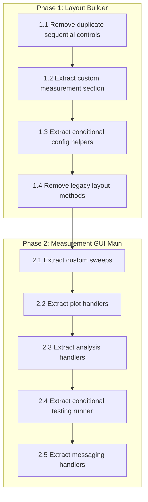

# Refactoring Remaining Plan

## Current State

Refactoring to date has extracted layout tabs, sections (connection, optical, notes, status bar), Sample GUI UI, and config. The layout builder is ~2,060 lines; Measurement GUI main is ~7,600 lines.

---

## Phase 1: Layout Builder – Final Decomposition

**File:** [gui/measurement_gui/layout_builder.py](gui/measurement_gui/layout_builder.py)

### 1.1 Extract Sequential Controls (duplicate removal)

- **Issue:** Two implementations exist: `layout/sections/sequential_controls.py` (collapsible, in use) and `layout_builder._build_sequential_controls` (~130 lines, legacy).
- **Action:** Delete `_build_sequential_controls` and `build_sequential_controls` from layout_builder. Tab measurements already uses `_build_sequential_controls_collapsible` → `build_sequential_controls` from sections.
- **Verify:** `_build_sequential_controls` is not called from `build_modern_layout` or any active tab.

### 1.2 Extract Custom Measurement Section

- **Location:** Lines 1964–2013 (~50 lines).
- **Action:** Create `layout/sections/custom_measurement_section.py` with `build_custom_measurement_section(builder, parent)`. Replace `_build_custom_measurement_section` in layout_builder with a delegate.
- **Note:** [tab_custom_measurements.py](gui/measurement_gui/layout/tab_custom_measurements.py) uses this as fallback when `CustomMeasurementsBuilder` fails.

### 1.3 Extract Conditional Config Helpers

- **Location:** `_update_conditional_testing_controls`, `_update_final_test_controls`, `_load_conditional_config`, `_save_conditional_config` (~90 lines).
- **Action:** Move to `layout/sections/conditional_testing_quick.py` or a new `layout/conditional_config_helpers.py`, since they are used by the conditional testing section.
- **Dependency:** `_load_conditional_config` calls `gui._load_conditional_test_config()`; `_save_conditional_config` calls `gui._save_conditional_test_config()`. Keep these GUI methods in main.py; layout module stays UI-only.

### 1.4 Remove Legacy Layout Methods (dead code)

These methods are never called by `build_modern_layout`:

- `_build_connection_section` (~45 lines)
- `_build_mode_selection` (~75 lines)
- `_build_top_banner` (~50 lines)
- `_build_signal_messaging` (~45 lines)

**Action:** Search codebase for any references; if none, delete them. `build_all_panels` is legacy (no-op) and only used in layout_builder `_self_test`.

---

## Phase 2: Measurement GUI Main Decomposition

**File:** [gui/measurement_gui/main.py](gui/measurement_gui/main.py) (~7,600 lines, ~80 methods)

Decompose into focused modules while keeping `main.py` as the wiring layer.

### 2.1 Extract Custom Sweeps Logic

**Target:** `gui/measurement_gui/custom_sweeps.py`

**Methods to move (~350 lines):**

- `load_custom_sweeps`, `load_custom_sweep_methods`, `on_custom_sweep_method_selected`
- `load_custom_sweep_combinations`, `add_sweep_combination`, `edit_sweep_combination`, `delete_sweep_combination`, `save_sweep_combinations_to_json`

**Pattern:** Functions that take `gui` (MeasurementGUI) and operate on `gui.custom_sweep_*` attributes. Main retains thin wrappers.

### 2.2 Extract Plot / Analysis Handlers

**Target:** `gui/measurement_gui/plot_handlers.py`

**Methods to move (~800+ lines):**

- `_plot_measurement_in_background`, `plot_all_device_graphs`, `plot_all_sample_graphs`
- `run_full_sample_analysis`, `browse_sample_folder_for_analysis`, `clear_sample_folder_selection`
- `_update_stats_plots`, `_clear_stats_plots`, `_generate_sequence_summary`
- `update_classification_display`, `refresh_stats_list`, `update_stats_display`

**Note:** `plot_panels.py` and `plot_updaters.py` already exist. `plot_handlers.py` would hold the higher-level orchestration (e.g. threading, callbacks into gui).

### 2.3 Extract Analysis / Classification Logic

**Target:** `gui/measurement_gui/analysis_handlers.py`

**Methods to move (~600+ lines):**

- `_on_analysis_enabled_changed`, `update_analysis_stats`, `_update_live_classification_display`
- `_send_classification_notification`, `_run_analysis_if_enabled`, `_save_analysis_results`
- `_save_research_analysis`, `_append_classification_log`, `_run_retroactive_analysis`
- `reclassify_all_devices`, `_run_analysis_sync`, `_format_analysis_value`
- `_get_latest_analysis_for_device`

### 2.4 Extract Conditional Testing Runner

**Target:** `gui/measurement_gui/conditional_testing.py`

**Methods to move (~400 lines):**

- `_run_quick_test`, `_execute_single_sweep_for_conditional_test`, `_run_tiered_test`
- `run_conditional_testing`, `_update_conditional_testing_button_state`
- Keep `_load_conditional_test_config`, `_save_conditional_test_config` in main (called by layout).

### 2.5 Extract Messaging / Telegram

**Target:** `gui/measurement_gui/messaging_handlers.py`

**Methods to move (~80 lines):**

- `load_messaging_data`, `update_messaging_info`

### 2.6 Main.py Role After Extraction

`main.py` will:

- Define `MeasurementGUI` and its `__init__`
- Wire layout via `MeasurementGUILayoutBuilder`
- Register callbacks that delegate to the new modules
- Retain connection management, `measure_one_device`, and high-level orchestration
- Target size: ~3,000–4,000 lines

---

## Phase 3: Optional / Low Priority

### 3.1 Sample GUI Main

- **File:** [gui/sample_gui/main.py](gui/sample_gui/main.py) (~2,700 lines)
- Config and UI are already extracted. Remaining: business logic and event handlers.
- Decompose only if it becomes hard to maintain.

### 3.2 Pulse / Motor GUIs

- [gui/pulse_testing_gui/main.py](gui/pulse_testing_gui/main.py), [gui/motor_control_gui/main.py](gui/motor_control_gui/main.py)
- Decompose only when they grow or become unwieldy.

### 3.3 Unified Measurement API (Phase 4)

- Design shared abstraction for IV sweeps, pulse tests, sequential runs.
- Requires a design pass before implementation.

### 3.4 Import and Code Hygiene

- Add `TYPE_CHECKING` where useful to avoid circular imports.
- Align or document `Helpers/TSP_Testing_GUI_Standalone_V1/` usage of `Measurments` package.

---

## Suggested Execution Order

---

## Risks and Mitigations

| Risk               | Mitigation                                                                   |
| ------------------ | ---------------------------------------------------------------------------- |
| Circular imports   | Use lazy imports inside callbacks; keep `TYPE_CHECKING` for type hints       |
| Regression         | Run SampleGUI and MeasurementGUI smoke tests after each extraction           |
| Over-decomposition | Extract only cohesive method groups; avoid splitting single responsibilities |

---

## Reference

- [REFACTOR_REMAINING.md](REFACTOR_REMAINING.md) – current task list and completed items

