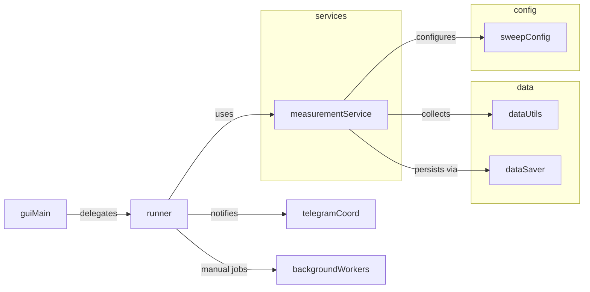

Measurements Package
====================

Core measurement logic, sweep configuration, data persistence, and instrument
integration used by every GUI in the application.

## Quick Map

- **Services**
  - `measurement_services_smu` – SMU measurements (delegates to modules in `services/smu/`)
  - `measurement_services_pmu` – PMU helpers and wrappers
  - `connection_manager` – Instrument connection lifecycle
  - `optical_controller` – Coordinating LEDs/optical hardware
  - `telegram_coordinator` – Post-measurement Telegram notifications
  - `background_workers` – Manual endurance/retention background jobs
- **Runners**
  - `single_measurement_runner` – Standard DC IV flow
  - `sequential_runner` – Sequential measurement orchestration
  - `pulsed_measurement_runner` – Pulsed IV / fast pulse flows
  - `special_measurement_runner` – ISPP, threshold search, transient decay, etc.
- **Data & Formatting**
  - `data_formats` – Common `DataFormatter` helpers
  - `data_saver` – Persistent storage of measurement artefacts
  - `data_utils` – Safe measurement helpers, normalization, etc.
- **Sweep Configuration**
  - `sweep_config` – Dataclasses for sweep parameters/instrument capabilities
  - `sweep_patterns` – Value generation helpers (`build_sweep_values`, etc.)
  - `source_modes` – Voltage/current source abstractions
- **Validation**
  - `json_config_validator` – JSON config validation helpers

## Typical Flow

### Adding a New Measurement Flow

1. Implement behaviour in the appropriate `services/smu/` module (or add a new
   module) and expose it through `MeasurementService`.
2. Update the relevant runner (or create a new runner) to call the new service
   method.
3. Extend `data_formats` / `data_saver` if additional artefacts are required.
4. Update GUI menus or triggers to surface the new measurement option.
