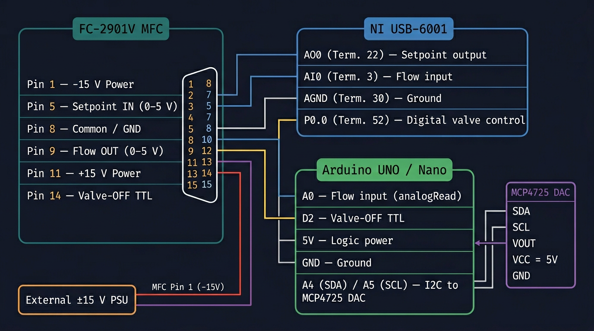

# FC-2901V Mass Flow Controller — Dashboard

A PyQt5 GUI for monitoring and controlling a **Tylan FC-2901V** mass flow controller via an analog 15-pin D-sub interface.  
Two hardware backends are supported: an **NI USB-6001** (NI-DAQmx) or an **Arduino UNO/Nano** (with MCP4725 DAC breakout).

<p align="center">
  
</p>

---

## Contents

```
tools/MASS_FLOW/
├── main.py                  # Dashboard GUI (entry point)
├── calibration_gui.py       # Standalone calibration editor
├── calibration.py           # Polynomial fit helpers
├── driver.py                # NI-DAQ and Arduino hardware drivers
├── calibrate_mfc.py         # CLI calibration workflow
├── config.json              # Hardware connection settings (auto-created)
├── calibration.json         # Saved calibration (auto-created after first calibration)
├── ui_settings.json         # Last-used poll interval
├── requirements.txt         # Python dependencies
├── wiring_diagram.png       # Hardware wiring reference
└── arduino_firmware/
    └── firmware.ino         # Arduino sketch
```

---

## Requirements

### Python packages

```
pip install -r requirements.txt
```

| Package    | Purpose                          |
|------------|----------------------------------|
| PyQt5      | GUI framework                    |
| numpy      | Polynomial calibration fitting   |
| nidaqmx    | NI-DAQ backend (optional)        |
| pyserial   | Arduino serial backend (optional)|

### Hardware (one of the following)

| Option | Hardware required |
|--------|------------------|
| **NI-DAQ** | NI USB-6001 or any NI-DAQmx-compatible multifunction DAQ |
| **Arduino** | Arduino UNO or Nano + MCP4725 I²C DAC breakout (Adafruit or equivalent) |

> **Both backends require an external ±15 V DC power supply for the MFC** — the Arduino and NI board cannot supply this.

---

## Wiring

<p align="center">
  <br/>
  <em>Signal paths for both the NI USB-6001 and Arduino backends. An external ±15 V supply is required for the MFC in both cases.</em>
</p>

### FC-2901V 15-pin D-sub (DE-15) pinout

| Pin | Signal              | Direction  | Level            |
|-----|---------------------|------------|-----------------|
| 1   | −15 V power         | Supply in  | −15 V DC         |
| 5   | Setpoint input      | Input      | 0–5 V analog     |
| 8   | Common / GND        | Reference  | 0 V              |
| 9   | Flow output         | Output     | 0–5 V analog     |
| 11  | +15 V power         | Supply in  | +15 V DC         |
| 14  | Valve-OFF TTL       | Input      | TTL (5 V logic)  |

> **Valve-OFF logic:** TTL HIGH = normal control (valve active); TTL LOW = valve closed.  
> All other pins (2, 3, 4, 6, 7, 10, 12, 13, 15) — leave unconnected.

---

### Option A — NI USB-6001

| NI Terminal        | Screw no. | → | MFC pin | Signal              |
|--------------------|-----------|---|---------|---------------------|
| AO0                | 22        | → | 5       | Setpoint (0–5 V)    |
| AI0                | 3         | ← | 9       | Flow output (0–5 V) |
| AGND               | 30        | — | 8       | Common / GND        |
| P0.0               | 52        | → | 14      | Valve-OFF TTL       |

Connect the MFC **Pin 1 (−15 V)** and **Pin 11 (+15 V)** to an external ±15 V power supply.  
Connect the power supply **ground** to MFC **Pin 8** and NI **AGND**.

---

### Option B — Arduino UNO / Nano + MCP4725 DAC

| Arduino pin | → | MFC pin | Signal                     |
|-------------|---|---------|----------------------------|
| A4 (SDA)    | → | MCP4725 SDA             | I²C data to DAC      |
| A5 (SCL)    | → | MCP4725 SCL             | I²C clock to DAC     |
| —           | MCP4725 VOUT → | 5  | Setpoint (0–5 V)     |
| A0          | ← | 9       | Flow output (0–5 V)        |
| D2          | → | 14      | Valve-OFF TTL              |
| 5 V         | → | MCP4725 VCC + Pin 8   | Logic + MFC GND      |
| GND         | — | 8       | Common / GND               |

**MCP4725 wiring summary:**

```
Arduino A4  ─── MCP4725 SDA
Arduino A5  ─── MCP4725 SCL
Arduino 5V  ─── MCP4725 VCC
Arduino GND ─── MCP4725 GND
MCP4725 VOUT ── MFC Pin 5  (setpoint 0–5 V)
```

**External ±15 V supply:**
```
PSU +15 V ── MFC Pin 11
PSU −15 V ── MFC Pin 1
PSU GND   ── MFC Pin 8  (also connect to Arduino GND)
```

#### Arduino firmware

Open `arduino_firmware/firmware.ino` in the Arduino IDE, install the `Adafruit_MCP4725` library via the Library Manager, then upload to the board.  
Default baud rate: **115 200**.

---

## Running the dashboard

```bash
# From the repository root:
python -m tools.MASS_FLOW.main

# Or directly from the tools/MASS_FLOW directory:
python main.py
```

### First launch

1. The window opens with the **Hardware Connection** panel expanded.
2. Select your backend (NI-DAQ or Arduino) and choose the device/port.
3. Press **Connect** — the panel auto-collapses on success.
4. Use the **ON / OFF** buttons to open or close the valve.
5. Drag the **Setpoint** slider or type a value and press **Apply Setpoint**.
6. The arc gauge and history sparkline update in real time.

### Calibration

On startup the app looks for `calibration.json` next to `main.py`.  
If no file is found you are prompted to browse for one or continue without.

To build or update a calibration open the **Calibration Tool…** button — this launches `calibration_gui.py` as a separate window (it can also be run standalone):

```bash
python calibration_gui.py
```

---

## Calibration workflow

1. Open the **Calibration Tool**.
2. Set **Gas** and **Full scale** to match your MFC configuration.
3. For each setpoint:
   - Command the MFC to a known setpoint (using the main dashboard or manually).
   - Read the MFC display (device reading) and your reference flow meter.
   - Enter both values as a new row in the table.
4. Collect at least **2 points** (3+ recommended for quadratic).
5. Click **Fit Model** — the polynomial equation and error metrics appear.
6. Click **Save Calibration…** — the file is written and the main dashboard reloads it automatically.

### What the calibration does

A polynomial `y = f(x)` is fitted where `x` = raw MFC reading and `y` = reference ("true") flow.  
Every live reading is passed through this correction and shown as **corr: X.X sccm** below the gauge.

For a simple linear scale error a **1st-order (linear)** fit is sufficient.  
For MFCs with nonlinear response use **2nd-order (quadratic)**.

### CLI calibration (auto-setpoint mode)

For automated multi-point calibration while connected to hardware:

```bash
# NI-DAQ backend, 9 setpoints, linear fit, Argon gas:
python calibrate_mfc.py --mode auto --driver nidaq --device Dev1 --gas Ar

# Arduino backend:
python calibrate_mfc.py --mode auto --driver arduino --port COM3 --gas N2

# Manual entry (no hardware required):
python calibrate_mfc.py --mode manual --gas Ar --order 2
```

---

## Configuration files

### `config.json`

Created automatically on first connection. Edit to pre-populate connection settings:

```json
{
  "driver": "nidaq",
  "full_scale_sccm": 200.0,
  "nidaq": {
    "device_name": "Dev1",
    "ao_setpoint_channel": "ao0",
    "ai_flow_channel": "ai0",
    "do_valve_off_channel": "port0/line0"
  },
  "arduino": {
    "port": "COM3",
    "baudrate": 115200,
    "timeout_s": 0.5
  }
}
```

### `calibration.json` (example)

```json
{
  "created_utc": "2025-01-01T12:00:00Z",
  "gas": "Ar",
  "full_scale_sccm": 200.0,
  "fit": {
    "model": "polynomial",
    "order": 1,
    "coefficients": [1.0234, -0.512],
    "rmse_sccm": 0.42,
    "max_abs_error_sccm": 0.81
  },
  "points": [
    {"device_sccm": 0.0,   "reference_sccm": 0.0},
    {"device_sccm": 50.2,  "reference_sccm": 50.9},
    {"device_sccm": 100.5, "reference_sccm": 102.2},
    {"device_sccm": 151.0, "reference_sccm": 153.8},
    {"device_sccm": 200.0, "reference_sccm": 204.2}
  ],
  "notes": "Post-installation check, lab temp 22°C"
}
```

---

## Troubleshooting

| Symptom | Likely cause | Fix |
|---------|-------------|-----|
| NI devices list shows nothing | NI-DAQmx not installed or no device connected | Install [NI-DAQmx drivers](https://www.ni.com/en/support/downloads/drivers/download.ni-daq-mx.html) |
| Arduino not found in port list | Driver not installed or device not plugged in | Install CH340/CP2102 USB driver; replug the board |
| Flow reads 0 V / 0 sccm continuously | AI wiring issue or MFC not powered | Check Pin 9 → AI0 wire and ±15 V supply |
| Setpoint has no effect | AO wiring issue or valve closed | Check Pin 5 → AO0 wire; press **ON** button |
| `Unexpected Arduino response` | Wrong port, wrong firmware, or baud mismatch | Verify firmware is uploaded; check baud rate in GUI matches firmware |
| Corrected value missing | No `calibration.json` loaded | Open Calibration Tool and save a calibration |

---

## Serial protocol (Arduino firmware)

| Command         | Response         | Description                          |
|-----------------|------------------|--------------------------------------|
| `?\r\n`         | `FC2901V_CTRL\r\n`| Identity check (used on connect)    |
| `R\r\n`         | `F:<sccm>\r\n`   | Read current flow (8-sample average) |
| `S:<sccm>\r\n`  | `OK\r\n`         | Set flow setpoint                    |
| `O:1\r\n`       | `OK\r\n`         | Enable valve (normal control)        |
| `O:0\r\n`       | `OK\r\n`         | Close valve (valve-OFF TTL low)      |
