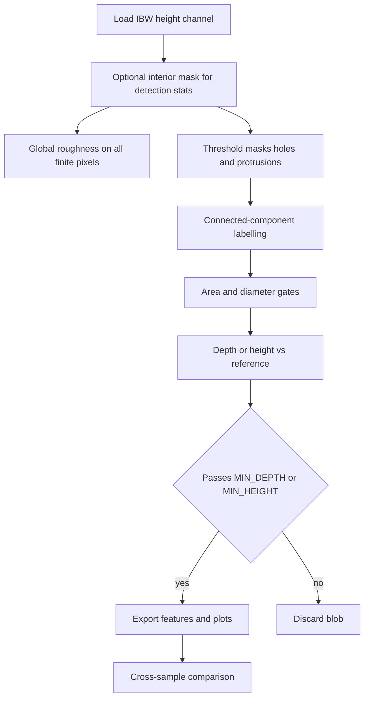

# AFM 3D Surface Analyser — Methodology & User Guide

This tool batch-processes Atomic Force Microscopy (AFM) height maps from Asylum Research / Igor Binary Wave (`.ibw`) files: it segments putative **holes** (valleys) and **protrusions** (peaks), measures geometry and roughness, exports numerical tables, and builds comparative figures.

This document serves both as a **user manual** and as a **methods appendix** suitable for citation in a thesis or journal article. Parameters referenced below correspond to symbols in `main.py` unless noted.

---

## 1. Algorithmic Pipeline (overview)

At a high level, each scan is treated as a discrete sampling \(z_{ij}\) of surface height (nanometres) on a rectangular pixel lattice. The pipeline is:



---

## 2. Thesis-oriented methodology

### 2.1. Purpose and scope of the model

The software answers an **operational** question: given a **single topographic image** per scan (already flattened in external software), which pixels belong to statistically extreme lows (“holes”) or highs (“protrusions”), and how large are those regions in physical units?

It does **not** perform blind tip–sample deconvolution, nor does it classify chemistry or material phases. Any interpretation as “true nanoscale voids” requires corroboration (independent scans, line profiles, complementary microscopy, or physics-based models). What is rigorously defined here is **thresholded topography relative to a chosen global reference** on the field of view.

### 2.2. Input data and preprocessing assumptions

**File format.** Heights are read from `.ibw` via `igor2`; the selected wave (`CHANNEL`, default index `0`) is interpreted as height in metres and converted to **nanometres**.

**Lateral scale.** Pixel spacing (nm) is taken from the wave header (`sfA`). The implementation assumes a **square pixel grid**: one lateral scale applies to both axes. Scan extent follows as \(L_x = n_x \cdot \Delta x\), \(L_y = n_y \cdot \Delta y\) (µm in summaries).

**Plane levelling.** **No least-squares plane subtraction or line-by-line levelling is applied inside this script.** The thesis text should state explicitly that scans were **pre-levelled** (e.g. in Igor, Gwyddion, or the microscope software) before export. All thresholds and roughness moments are therefore computed from the **levelled height field** provided.

**Missing data.** Non-finite pixels (`NaN`) are excluded from masks where noted.

### 2.3. Domains: full image vs interior (detection only)

Two spatial domains appear:

1. **Full valid support** \(\Omega_{\mathrm{all}} = \{(i,j) : z_{ij}\ \text{finite}\}\) — used for **global roughness** (Section 2.4).
2. **Interior support** \(\Omega_{\mathrm{int}}\) — a central sub-rectangle obtained by **cropping** `EDGE_EXCLUDE_NM` (or `EDGE_EXCLUDE_PX`) from each border of the image. This suppresses common AFM frame artefacts (scanner bow, incomplete feedback at edges) from influencing detection statistics and from contributing masked “holes.”

If `THRESHOLD_USE_INTERIOR_ONLY` is `True` (default), **mean, standard deviation, median, and MAD** used for **thresholding** are evaluated **only on** \(\Omega_{\mathrm{int}}\). The binary masks are still restricted to \(\Omega_{\mathrm{int}}\) for classification (finite height required).

**Thesis wording suggestion:** *“Detection thresholds were estimated from the interior  \(|\Omega_{\mathrm{int}}|\)  pixels to reduce edge artefacts; global roughness moments were computed over all finite pixels unless otherwise stated.”*  
(Adjust if you later change roughness to interior-only in code.)

### 2.4. Global roughness and height-distribution moments

Let \(\{z_k\}_{k=1}^{N}\) be all finite heights (typically over \(\Omega_{\mathrm{all}}\)). Define the sample mean \(\bar{z} = \frac{1}{N}\sum_k z_k\) and residuals \(\delta_k = z_k - \bar{z}\).

The implementation reports (among others):

| Symbol | Name | Definition (implemented) |
|--------|------|---------------------------|
| \(R_a\) | Arithmetic mean roughness | \(\frac{1}{N}\sum_k |\delta_k|\) |
| \(R_q\) | RMS roughness | \(\sqrt{\frac{1}{N}\sum_k \delta_k^2}\) |
| \(R_z\) | Range | \(\max_k z_k - \min_k z_k\) |
| \(R_{pv}\) | Robust peak–valley | \(P_{99}(\{z_k\}) - P_{1}(\{z_k\})\) |
| \(R_{sk}\) | Skewness (normalized) | \(\frac{1}{N}\sum_k \delta_k^3 / R_q^{\,3}\) (0 if \(R_q{=}0\)) |
| \(R_{ku}\) | Kurtosis (normalized) | \(\frac{1}{N}\sum_k \delta_k^4 / R_q^{\,4}\) (0 if \(R_q{=}0\)) |

Percentiles \(P_q\) are empirical. These quantities align with common ISO-style **areal** summaries when applied to a single AFM frame (see ISO 25178 for areal parameters; your examiner may expect explicit reference to the standard you adopt).

**Interpretation.** \(R_{sk} < 0\) indicates an asymmetric distribution with a heavier **left** tail (more deep valleys than symmetric Gaussian texture would produce); \(R_{ku} > 3\) suggests heavier tails than Gaussian (“spiky” or strongly heterogeneous texture).

### 2.5. Segmentation: binary masks for holes and protrusions

Let \(\mathcal{S} \subseteq \Omega_{\mathrm{int}}\) be pixels used for **statistics** (by default \(\mathcal{S} = \Omega_{\mathrm{int}} \cap \Omega_{\mathrm{all}}\)).

#### 2.5.1 Classical (mean / standard deviation) thresholds

Sample mean \(\mu = \frac{1}{|\mathcal{S}|}\sum_{(i,j)\in\mathcal{S}} z_{ij}\) and sample SD \(\sigma = \sqrt{\frac{1}{|\mathcal{S}|}\sum_{\mathcal{S}}(z_{ij}-\mu)^2}\).

With user multipliers \(N_h=\)`HOLE_THRESHOLD_SD`, \(N_p=\)`PROT_THRESHOLD_SD`:

\[
T_{\mathrm{hole}} = \mu - N_h \sigma,\qquad T_{\mathrm{prot}} = \mu + N_p \sigma.
\]

Initial masks:

\[
M_{\mathrm{hole}} = \{(i,j)\in \Omega_{\mathrm{int}} : z_{ij} < T_{\mathrm{hole}}\},\quad
M_{\mathrm{prot}} = \{(i,j)\in \Omega_{\mathrm{int}} : z_{ij} > T_{\mathrm{prot}}\}.
\]

Under an ideal Gaussian texture model, \(N=3\) corresponds loosely to “beyond 99.7% of the bulk.” Real surfaces are non-Gaussian; \(N\) should be treated as a **tunable classification parameter**, justified by sensitivity analysis or by comparison to independent micrographs.

#### 2.5.2 Robust thresholds (median / MAD)

When `USE_ROBUST_THRESHOLD` is enabled, location is the **median** \(m = \mathrm{median}\{z_{ij} : (i,j)\in\mathcal{S}\}\). Let the median absolute deviation be

\[
\mathrm{MAD} = \mathrm{median}\{|z_{ij} - m| : (i,j)\in\mathcal{S}\}.
\]

The code uses a **Gaussian-consistency scale**

\[
\sigma_{\mathrm{rob}} = 1.4826 \times \mathrm{MAD},
\]

because for Gaussian data \(\mathrm{MAD}\) relates to the standard deviation by \(\sigma \approx 1.4826\,\mathrm{MAD}\). Thresholds become

\[
T_{\mathrm{hole}} = m - N_h \sigma_{\mathrm{rob}},\qquad T_{\mathrm{prot}} = m + N_p \sigma_{\mathrm{rob}}.
\]

**Fallback.** If \(\sigma_{\mathrm{rob}} = 0\) (degenerate flat interior, or MAD \(=0\)) but robust mode is still on, the implementation falls back to **median \(\pm N\cdot\sigma\)** using the classical \(\sigma\) on \(\mathcal{S}\). If robust mode is off, classical \(\mu \pm N\sigma\) is used.

**Rationale for the thesis.** Rough or **heavy-tailed** height distributions inflate \(\sigma\); that pushes \(T_{\mathrm{hole}}\) downward and **inflates false hole area**. Robust spread reduces sensitivity to distant tails while preserving a single global threshold interpretable in “effective sigma” units.

#### 2.5.3 Why purely local SD thresholding was avoided as default

A common alternative thresholds each pixel against **local** mean and SD in a small window. When the window scale matches texture correlation length, **every valley becomes “\(N\) sigma below local mean”**, so the union of masks often equals **most of the image**. For that reason this pipeline defaults to **global** (or robust-global) thresholds on \(\mathcal{S}\), complemented by **physical gates** (area, diameter, depth) rather than pixel-wise local Normal tests.

### 2.6. Connected components and topology

Each binary mask is partitioned into **connected components** using `scipy.ndimage.label` with the **default structuring element** (four-neighbour connectivity on the pixel grid: horizontal and vertical adjacency only). Each component receives a unique integer label; disjoint depressed regions count as separate holes.

### 2.7. Post-segmentation rejection rules

For each labelled component \(R\):

1. **Minimum area (pixels).** If \(|R| <\) `MIN_AREA_PX`, discard (noise / quantisation speckle).
2. **Minimum equivalent diameter (holes only).** Equivalent diameter \(D_{\mathrm{eq}} = 2\sqrt{A/\pi}\) with \(A\) the physical area \(|R|\cdot (\Delta x)^2\) (nm²). If `MIN_EQUIV_DIAMETER_NM` \(>0\) and \(D_{\mathrm{eq}}\) is below that cutoff, discard.
3. **Image border.** If `REJECT_FEATURES_TOUCHING_IMAGE_BORDER` is `True`, discard components touching the outermost rows/columns of the **full** raster (distinct from the interior statistical mask).

These rules should be stated explicitly in the thesis as **inclusion criteria** for reported defects.

### 2.8. Amplitude: hole depth and protrusion height

**Reference mean for measurement.** Feature measurement uses `background_mean = \mu` — the **classical interior mean** from `detect_features` (not the median). This keeps hole/protrusion amplitude comparable to the same \(\mu\) that appears in exported threshold diagnostics.

#### Holes

Let \(z_{\min}^{(R)} = \min_{(i,j)\in R} z_{ij}\).

- **Legacy depth** (annulus off): \(d^{(R)} = \mu - z_{\min}^{(R)}\) (non-negative for sub-mean pits).
- **Annulus depth** (when `ANNULUS_WIDTH_NM` or `ANNULUS_WIDTH_PX` \(>0\)): morphologically dilate \(R\) by an integer number of steps (connectivity-2 square structuring element). Let \(\mathrm{Ring}\) be dilated set minus \(R\). Then

  \[
  d^{(R)} = \max\left(0,\ \mathrm{median}\{z_{ij} : (i,j)\in \mathrm{Ring},\ z_{ij}\ \mathrm{finite}\} - z_{\min}^{(R)}\right).
  \]

  If the ring carries no finite pixels, the code **falls back** to legacy depth vs \(\mu\) (`depth_reference` fields in CSV record this).

A component is **accepted** only if \(d^{(R)} \ge\) `MIN_DEPTH_NM`. The comparison uses **non-strict** rejection on the lower side: values **equal** to the cutoff are **retained** (`amplitude < MIN_DEPTH_NM` rejects).

#### Protrusions

Let \(z_{\max}^{(R)} = \max_{(i,j)\in R} z_{ij}\). Height \(h^{(R)} = z_{\max}^{(R)} - \mu\). Retained if \(h^{(R)} \ge\) `MIN_HEIGHT_NM`. **No annulus** is applied to protrusions in the current implementation.

### 2.9. Geometric descriptors exported per feature

For each accepted component \(R\):

- **Area** \(A\) (nm²): pixel count \(\times (\Delta x)^2\).
- **Equivalent diameter** \(D_{\mathrm{eq}}\) as above.
- **Centroid** \((x_c, y_c)\) (nm): mean column and row indices \(\times \Delta x\), \(\Delta y\).

Peak height coordinate stores \(z_{\min}^{(R)}\) or \(z_{\max}^{(R)}\) as appropriate.

### 2.10. Scan-level aggregates (summary row)

Per scan, hole **surface coverage** is computed as the fraction of scan area covered by union of hole (and analogously protrusion) regions in physical units; summary CSV reports percentages and combined totals. **Feature density** divides counts by scan area (µm²).

Optional **fixed-depth** metrics (`FIXED_DEPTH_CUTOFFS_NM`) record, on \(\Omega_{\mathrm{int}}\), the percentage of pixels deeper than fixed cutoffs below the **interior median** — a complementary view that does not depend on connected components.

### 2.11. Scan-quality proxies (exploratory)

Two heuristics flag problematic acquisitions:

1. **Line correlation:** mean Pearson correlation between **adjacent horizontal rows** (slow-scan direction sensitivity).
2. **Sharpness:** variance of the Laplacian of \((z-\bar{z})/R_q\) over the map — responds to high-frequency content vs blur.

These are **secondary** to physical segmentation and should be cited as exploratory unless calibrated against known standards.

### 2.12. Multi-scan experiments and replication

The script can batch several experiment folders; each output run groups comparisons under `comparison/`. Files sharing the same **`base_sample_name`** (derived by stripping trailing replicate indices per `REPLICATE_STRIP_PATTERN`) receive replicate-level plots and a **threshold-review** HTML that reloads each `.ibw` and repeats detection for visual QA (`PLOT_COMP_THRESHOLD_REVIEW`).

### 2.13. Limitations and recommended thesis disclosures

- Threshold segmentation is **non-unique**: results depend on levelling, \(N_h,N_p\), robust vs classical statistics, edge crop, and gates.
- **Tip convolution** broadens pits and rounds peaks; lateral sizes are **apparent**, not necessarily true openings.
- Classical \(\sigma\) on \(\mathcal{S}\) is **not** identical to \(R_q\) computed over \(\Omega_{\mathrm{all}}\); both may appear in outputs—state which drives thresholds.
- Reporting should include **parameter table** and, where possible, **representative threshold-review figures** for each sample family.

---

## 3. Tool configuration

Open `main.py` and adjust the variables at the very top under `CONFIGURATION`:

- `CHANNEL` — IBW height channel index.
- `HOLE_THRESHOLD_SD` / `PROT_THRESHOLD_SD` — Multipliers \(N_h\), \(N_p\) for hole/protrusion thresholds (Section 2.5).
- `USE_ROBUST_THRESHOLD` — Use median and MAD-scaled spread (Section 2.5.2).
- `ANNULUS_WIDTH_NM` / `ANNULUS_WIDTH_PX` — Rim dilation for hole depth (Section 2.8); both zero ⇒ legacy depth vs \(\mu\).
- `MIN_EQUIV_DIAMETER_NM` — Minimum hole equivalent diameter (nm); `0` = off.
- `MIN_AREA_PX` — Minimum blob area in pixels.
- `MIN_DEPTH_NM` / `MIN_HEIGHT_NM` — Amplitude gates (Section 2.8).
- `EDGE_EXCLUDE_NM` / `EDGE_EXCLUDE_PX` — Interior crop for detection (Section 2.3).
- `REJECT_FEATURES_TOUCHING_IMAGE_BORDER` — Border rejection (Section 2.7).
- `PLOT_COMP_THRESHOLD_REVIEW` — Grouped threshold-review HTML (Section 2.12).
- `SAVE_PLOTS` — Master switch for plot generation.
- `DOWNSAMPLE_3D` — Max pixels per side for the 3D surface plot.

---

## 3.1. Folder-based substrate comparison workflow

Each subfolder under `Data/` is one **comparison set**. Put every scan you want compared together in that folder — duplicating `.ibw` files across folders is fine.

**Example layout:**

```
Data/
├── glass_vs_glass_ito/
│   ├── Glass_0001.ibw
│   ├── Glass_0002.ibw
│   ├── Glass_ITO_0001.ibw
│   └── Glass_ITO_0002.ibw
├── glass_vs_si/
│   ├── Glass_0001.ibw
│   └── Si_0001.ibw
└── quartz_bare/
    └── Quartz_0001.ibw
```

**Naming convention** (replicate numbers are stripped automatically):

| Role | Filename example | `base_sample_name` | Parsed as |
|------|------------------|-------------------|-----------|
| Bare substrate | `Glass_0001.ibw` | `Glass` | baseline |
| With coating | `Glass_ITO_0001.ibw` | `Glass_ITO` | deposit on `Glass` |
| PMMA on Si | `Si_PMMA_0001.ibw` | `Si_PMMA` | deposit on `Si` |

Use `_` to separate substrate from deposited layer (`Glass_ITO`, `Glass_PMMA`, `Si_ITO`). Supported substrate tokens are whatever you place before the first underscore (`Glass`, `Quartz`, `Si`, etc.).

**Optional baseline override:** if auto-pairing is ambiguous, add a one-line `baseline.txt` in the comparison folder containing the exact `base_sample_name` of the reference scan (e.g. `Glass`).

**Defect density metrics** (per scan and per replicate-averaged sample):

| Column | Meaning |
|--------|---------|
| `holes_per_um2` | Hole count / scan area |
| `prots_per_um2` | Protrusion count / scan area |
| `defects_per_um2` | Combined holes + protrusions / scan area |
| `defects_per_mm2` | Same as above × 10⁶ (reporting convenience) |

After processing, each experiment's `comparison/` folder includes **substrate-vs-deposit** outputs (see Section 4.2).

---

## 4. Outputs

All results are saved in the `Output/` directory under a timestamped run folder:

- `Output/Run_<YYYY-MM-DD_HH-MM-SS>/<experiment_name>/...`
- each top-level folder in `Data/` is treated as its own experiment
- loose `.ibw` files directly in `Data/` are processed as experiment `unnamed`

### 4.1. Per-Sample Output (`Output/Run_.../<experiment>/<sample>/<replicate>/`)
- **`holes.csv` / `protrusions.csv`**: Detailed per-feature measurements (area, equivalent diameter, depth/height, centroid). Hole rows may include `depth_reference` (`annulus` / `global` / `global_fallback`) and `hole_rim_z_nm` when annulus depth is used.
- **`height_map_2d.html` / `.png`**: False-colour 2D height map.
- **`height_map_3d.html` / `.png`**: Interactive 3D surface render.
- **`feature_map.html` / `.png`**: Mask overlay showing detected holes (blue) and protrusions (orange) with hover-stats.
- **`histograms.html` / `.png`**: 4-panel distribution of feature sizes and depths.
- **`roughness_analysis.html` / `.png`**: Height distribution histogram with Gaussian fit, plus a comprehensive table of standard roughness metrics and scan quality scores.
- **`all_plots_dark.html` / `all_plots_light.html`**: Folder-level merged dashboards for quick browsing.

### 4.2. Cross-Sample Comparison (`Output/Run_.../<experiment>/comparison/`)

Grouped by **`base_sample_name`** (same logical sample after stripping trailing replicate indices, see `REPLICATE_STRIP_PATTERN` in `main.py`):

- **`{base_sample_name}_replicates/threshold_review_grid_light.html`** (and other theme suffixes): **one figure, multiple rows** — each row is one `.ibw` for that base; **left** = Viridis height map, **right** = greyscale height with holes (blue) and protrusions (orange), matching per-sample feature maps. Files are **reloaded** and detection is **re-run** here so this view always matches your current threshold settings.
- Bases with **only one** scan still get a threshold review file at **`comparison/threshold_review_<slug>_light.html`** (slug derived from `base_sample_name`).

Other comparison artifacts:

- **`summary.csv`**: One row per file; includes **`ibw_path`** (absolute path to the source `.ibw`) for downstream reloads and the threshold-review HTML.
- **`surface_coverage.html` / `.png`**: Stacked bar chart showing the % of the physical area taken up by holes vs protrusions.
- **`surface_coverage_box.html` / `.png`**: Box plot of total surface coverage by sample group (replicate outlier detection).
- **`feature_density.html` / `.png`**: Bar chart comparing holes/µm², protrusions/µm², and combined total defects/µm² across samples (area-normalised).
- **`substrate_delta_summary.csv`**: Substrate vs deposit delta table (density, coverage, roughness) with fold-change when paired.
- **`substrate_defect_density.html`**: Grouped bar chart of substrate baselines vs coated samples.
- **`substrate_delta_chart.html`**: Deposit − substrate change in combined defect density (defects/µm²).
- **`roughness_comparison.html` / `.png`**: 6-panel bar chart comparing Ra, Rq, Rz, Rpv, Rsk, and Rku.
- **`rq_box.html` / `.png`**: Box plot of RMS roughness (`Rq`) by sample group.
- **`stats_overview.html` / `.png`**: 4-panel bar chart summarising feature density, depths, diameters, and heights (with ±1 std error bars).
- **`depth_vs_diameter.html` / `.png`**: Bubble chart of mean depth vs mean diameter (bubble size proportional to feature density).
- **`ranking_table.html` / `.png`**: A ranked table scoring samples based on lowest hole density, shallowest depth, and smallest diameter, plus Ra roughness.
- **`*_box.html` / `.png`**: Individual box-and-whisker plots for the distributions of depths and diameters across all samples.
- **`origin data/*.txt`**: Origin-compatible tab-separated data corresponding to every plot.
- **`all_plots_dark.html` / `all_plots_light.html`**: Combined dark/light comparison dashboards in one page per theme.
