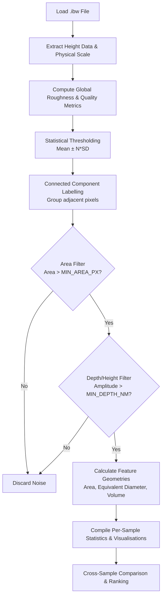

# AFM 3D Surface Analyser — Methodology & User Guide

This tool is a comprehensive batch-processing script designed to analyse 3D AFM (Atomic Force Microscopy) data from Asylum/Igor Binary Wave (`.ibw`) files. It extracts statistically rigorous measurements of surface features (holes and protrusions) and evaluates overall surface roughness and scan quality.

This README serves both as a user manual and a **methodology reference for academic writing/theses**.

---

## 1. Algorithmic Pipeline

The script processes each AFM scan through a rigorous mathematical pipeline to ensure fair cross-sample comparison.

---

## 2. Methodology & Mathematical Basis (For Thesis Writing)

### 2.1. Global Roughness Analysis
Before identifying distinct features, the baseline topography of the scan is established using ISO-standard surface roughness parameters. The primary metric used is the **RMS Roughness ($R_q$)**, which represents the standard deviation of all height values across the scanned area.

Other calculated parameters include:
*   **$R_a$ (Arithmetic Mean Roughness)**: The average absolute deviation from the mean line.
*   **$R_z$ (Maximum Peak-to-Valley)**: The absolute range of the data.
*   **$R_{sk}$ (Skewness)**: Measures the symmetry of the surface profile about the mean line. A negative $R_{sk}$ indicates a surface dominated by deep valleys/holes, while a positive $R_{sk}$ indicates a surface dominated by peaks.
*   **$R_{ku}$ (Kurtosis)**: Measures the "sharpness" of the surface height distribution. A Gaussian surface has $R_{ku} = 3$. Values $>3$ indicate spiky surfaces with sharp peaks or deep holes.

### 2.2. Statistical Feature Thresholding
Rather than using arbitrary absolute thresholds, the script applies **global** statistical thresholding on the **interior** scan (same edge mask as detection).

**Default (mean / SD):** with interior mean $\mu$ and standard deviation $\sigma$,
*   **Holes:** $Z < \mu - N\sigma$
*   **Protrusions:** $Z > \mu + N\sigma$

**Robust mode (`USE_ROBUST_THRESHOLD`):** with interior median $m$ and MAD-based spread $\sigma_{\mathrm{rob}} \approx 1.4826 \times \mathrm{MAD}$,
*   **Holes:** $Z < m - N\sigma_{\mathrm{rob}}$
*   **Protrusions:** $Z > m + N\sigma_{\mathrm{rob}}$

$N$ is `HOLE_THRESHOLD_SD` or `PROT_THRESHOLD_SD`. Robust statistics cut false positives on **rough or long-tailed** surfaces, where a large $\sigma$ makes the mean$\pm N\sigma$ mask too permissive. `summary.csv` still records $\mu$ and $\sigma$ for reference.

**Local SD note:** purely **local** per-pixel mean$\pm N\cdot$local SD (small window) usually labels **most texture as holes** because every valley is a few “local sigmas” deep. Prefer global (or hybrid) thresholding plus **rim depth** and **size** constraints, not local SD alone.

### 2.3. Feature Isolation & Absolute Filtering
Once the statistical threshold separates the anomalies from the baseline, the data is passed through a Boolean mask. Adjacent flagged pixels are grouped together using **Connected-Component Labelling** (8-way connectivity).

Filters applied after labelling:
1.  **`MIN_AREA_PX`**: Blobs with fewer than this many pixels are discarded as speckle.
2.  **`MIN_EQUIV_DIAMETER_NM` (optional):** Blobs with equivalent diameter below this value (nm) are discarded — useful when pixel size varies between scans.
3.  **`MIN_DEPTH_NM` / `MIN_HEIGHT_NM`:** For **holes**, when annulus mode is enabled, *depth* is **rim minus pit** (see below); otherwise legacy depth is |$\mu - Z_{\min}$| in the blob. Protrusions use height vs the global $\mu$.

**Annulus depth (`ANNULUS_WIDTH_NM` or `ANNULUS_WIDTH_PX`):** depth = median($Z$ on an outer ring produced by dilating the blob) minus minimum $Z$ in the blob. If both widths are zero, depth uses the global mean $\mu$ vs pit minimum (legacy). If the ring has no valid height samples, the code falls back to the legacy definition.

**Tuning order (fewer false holes):** robust threshold $\rightarrow$ slightly increase $N$ if needed $\rightarrow$ `MIN_EQUIV_DIAMETER_NM` $\rightarrow$ annulus width $\approx$ hole scale $\rightarrow$ `MIN_DEPTH_NM`.

### 2.4. Scan Quality Metrics
Because blunt AFM tips or poor PID tracking can "smear" features, making deep holes appear broad and shallow, the script calculates two automated quality heuristics:
1.  **Sharpness Score (Laplacian Variance)**: The height map is normalized against $R_q$ and passed through a Laplacian filter (a 2nd-order spatial derivative). The variance of this Laplacian represents the density of high-frequency data. A low score indicates a blurry, smeared scan (blunt tip). A high score indicates a crisp scan, or a naturally highly granular/textured surface.
2.  **Tracking Correlation (Pearson Line-by-Line)**: Calculates the average Pearson correlation coefficient between adjacent horizontal scan rows. Poor AFM tracking (where the tip skips or streaks) results in decorrelated rows (scores $< 0.8$).

*(Note: Human eyes are easily tricked by software like Gwyddion, which automatically stretches colormaps to fit the data. A $0.5$ nm depression on a smooth sample can appear visually darker and "deeper" than a $1.0$ nm hole on a rough sample. This script eliminates that visual bias by relying entirely on the raw $Z$-sensor data).*

---

## 3. Tool Configuration

Open `main.py` and adjust the variables at the very top under `CONFIGURATION`:

- `CHANNEL` — IBW height channel index.
- `HOLE_THRESHOLD_SD` / `PROT_THRESHOLD_SD` — Multiplier $N$ for hole/protrusion threshold.
- `USE_ROBUST_THRESHOLD` — If `True`, use interior median and MAD-based $\sigma$ for thresholding.
- `ANNULUS_WIDTH_NM` / `ANNULUS_WIDTH_PX` — Dilations for rim-based hole depth; both zero = legacy depth vs global mean.
- `MIN_EQUIV_DIAMETER_NM` — Minimum equivalent hole diameter (nm); `0` = off.
- `MIN_AREA_PX` — Minimum blob area in pixels.
- `MIN_DEPTH_NM` / `MIN_HEIGHT_NM` — Amplitude gates (nm) after measurement.
- `SAVE_PLOTS` — Set `False` to skip plot generation (faster).
- `DOWNSAMPLE_3D` — Max pixels per side for the 3D surface plot.

---

## 4. Outputs

All results are saved in the `Output/` directory under a timestamped run folder:

- `Output/Run_<YYYY-MM-DD_HH-MM-SS>/<experiment_name>/...`
- each top-level folder in `Data/` is treated as its own experiment
- loose `.ibw` files directly in `Data/` are processed as experiment `unnamed`

### 4.1. Per-Sample Output (`Output/Run_.../<experiment>/<sample>/<replicate>/`)
- **`holes.csv` / `protrusions.csv`**: Detailed per-feature measurements (area, equivalent diameter, depth/height, centroid). Hole rows may include `depth_reference` (`annulus` / `global` / `global_fallback`) and `hole_rim_z_nm` when annulus depth is used.
- **`height_map_2d.html` / `.png`**: False-colour 2D height map.
- **`height_map_3d.html` / `.png`**: Interactive 3D surface render.
- **`feature_map.html` / `.png`**: Mask overlay showing detected holes (blue) and protrusions (orange) with hover-stats.
- **`histograms.html` / `.png`**: 4-panel distribution of feature sizes and depths.
- **`roughness_analysis.html` / `.png`**: Height distribution histogram with Gaussian fit, plus a comprehensive table of standard roughness metrics and scan quality scores.
- **`all_plots_dark.html` / `all_plots_light.html`**: Folder-level merged dashboards for quick browsing.

### 4.2. Cross-Sample Comparison (`Output/Run_.../<experiment>/comparison/`)
- **`summary.csv`**: A master spreadsheet containing one row per sample with mean metrics, total counts, densities, surface coverage percentages, and roughness parameters.
- **`surface_coverage.html` / `.png`**: Stacked bar chart showing the % of the physical area taken up by holes vs protrusions.
- **`surface_coverage_box.html` / `.png`**: Box plot of total surface coverage by sample group (replicate outlier detection).
- **`feature_density.html` / `.png`**: Bar chart comparing holes/µm² and protrusions/µm² across samples (area-normalised).
- **`roughness_comparison.html` / `.png`**: 6-panel bar chart comparing Ra, Rq, Rz, Rpv, Rsk, and Rku.
- **`rq_box.html` / `.png`**: Box plot of RMS roughness (`Rq`) by sample group.
- **`stats_overview.html` / `.png`**: 4-panel bar chart summarising feature density, depths, diameters, and heights (with ±1 std error bars).
- **`depth_vs_diameter.html` / `.png`**: Bubble chart of mean depth vs mean diameter (bubble size proportional to feature density).
- **`ranking_table.html` / `.png`**: A ranked table scoring samples based on lowest hole density, shallowest depth, and smallest diameter, plus Ra roughness.
- **`*_box.html` / `.png`**: Individual box-and-whisker plots for the distributions of depths and diameters across all samples.
- **`origin data/*.txt`**: Origin-compatible tab-separated data corresponding to every plot.
- **`all_plots_dark.html` / `all_plots_light.html`**: Combined dark/light comparison dashboards in one page per theme.
